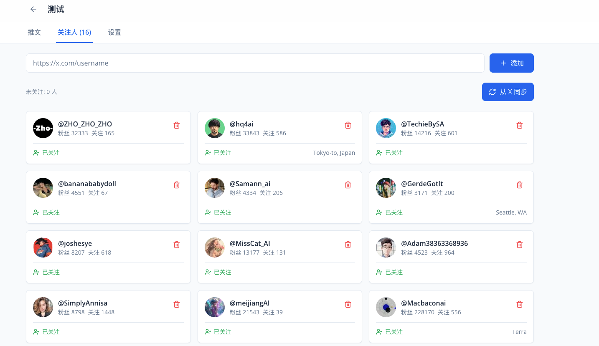
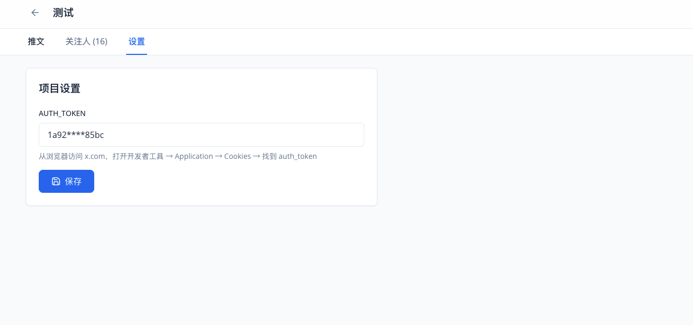

# X Twitter 推文管理系统

## 项目概述

从 Twitter/X 获取推文的系统，用于产品和运营团队使用。

技术来源：https://github.com/xiaoxiunique/x-kit

**技术栈：**
- 后端：TypeScript + Node.js + Fastify + Prisma
- 前端：React + Vite + Tailwind CSS
- 数据库：MySQL 8.0

## 截图

### 项目列表页


### 用户关注管理



### 配置 token




## 功能特性

### 项目管理
- 创建、编辑、删除项目
- 每个项目有独立的 AUTH_TOKEN 和关注人列表
- 查看关注人数和推文总数

### 关注人管理
- 通过主页链接添加关注人（如 https://x.com/0xbisc）
- 自动获取用户信息（头像、粉丝数等）
- 批量关注功能
- 关注状态跟踪

### 推文获取
- 自动获取时间线推文
- 按日期筛选查看推文
- 手动"现在更新"获取最新推文
- 显示推文内容、图片、视频、互动数据
- 原始链接跳转

### 定时任务
- 每天早上 3 点自动获取推文
- 抓取日志记录

## 快速开始

### 2. 配置数据库

```bash
cd backend
cp .env.example .env
```

或使用 Docker 启动（见下方）

### 3. 初始化数据库

```bash
npm install
npx prisma db push
```

### 4. 启动后端

```bash
npm run dev
```

后端将在 http://localhost:3000 启动

### 5. 启动前端

```bash
cd frontend
npm install
npm run dev
```

前端将在 http://localhost:5173 启动

### 使用 Docker Compose 一键启动

```bash
docker-compose up -d
```

访问：
- 前端：http://localhost:5173
- 后端 API：http://localhost:3000
- API 文档：http://localhost:3000/docs

## 获取 AUTH_TOKEN

1. 在浏览器中访问 https://x.com 并登录
2. 打开开发者工具（F12）
3. 进入 Application 标签
4. 找到 Cookies → x.com
5. 找到 `auth_token` cookie 的值

## 项目结构

```
x-twitter-system/
├── backend/                    # 后端
│   ├── src/
│   │   ├── main.ts            # Fastify 应用入口
│   │   ├── config.ts          # 环境变量配置
│   │   ├── routes/            # 路由
│   │   ├── services/          # 业务逻辑
│   │   └── utils/            # 工具函数
│   ├── prisma/
│   │   └── schema.prisma     # Prisma schema
│   └── package.json
├── frontend/                   # 前端
│   ├── src/
│   │   ├── App.tsx
│   │   ├── pages/             # 页面组件
│   │   ├── lib/               # 工具函数和 API
│   │   └── types/            # TypeScript 类型
│   └── package.json
└── docker-compose.yml          # Docker 编排
```

## 开发命令

### 后端

```bash
cd backend
npm run dev              # 开发模式（热重载）
npm run build            # 构建
npm run start            # 生产启动
npm run db:generate       # 生成 Prisma Client
npm run db:push          # 推送 schema 到数据库
npm run fetch            # 手动触发推文抓取
```

### 前端

```bash
cd frontend
npm run dev              # 开发模式
npm run build            # 构建
npm run preview           # 预览构建结果
```

## API 文档

启动后端后访问：http://localhost:3000/docs

主要 API 端点：
- GET /api/projects - 获取项目列表
- POST /api/projects - 创建项目
- GET /api/projects/:id - 获取项目详情
- PUT /api/projects/:id - 更新项目
- DELETE /api/projects/:id - 删除项目
- GET /api/projects/:projectId/following - 获取关注人列表
- POST /api/projects/:projectId/following - 添加关注人
- POST /api/projects/:projectId/following/follow-all - 批量关注
- GET /api/projects/:projectId/tweets - 获取推文列表
- POST /api/projects/:projectId/tweets/fetch - 手动获取推文
